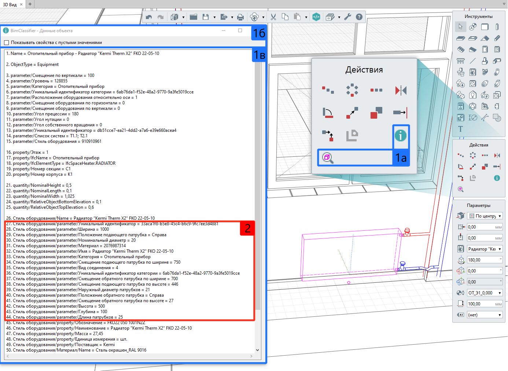

Add-on "BIM Classifier - Данные объекта"
========================================

Дополнение отображает полную информацию, доступную через API, о выбранном объекте ЦИМ. Оно устанавливается вместе в BIM Classifier и работает независимо от основного расширения.

.. note::

    Особенностью окна "BIM Classifier - Данные объекта" является отображение параметров стилей инженерного оборудования ``[2]``. Эти параметры можно использовать в правилах построения дерева объектов ЦИМ для BIM Classifier.

После установки расширения BIM Classifier, на панель "Действия" добавятся две новые команды ``[1а]``:

* ``BIM Classifier - Данные объекта`` — вызвать окно со списком всех данных ``[1в]`` выбранного объекта;
* ``Показать выделенные объекты`` — аналог командам "Выделить в модели" в спецификациях и во вкладках инженерных систем. Аналогичным образом показать выделенные объекты в 3D Виде.

.. important::

    Поскольку данные извлекаются посредством API, наименование атрибутов и их значения могут отличаться от атрибутов, локализованных в пользовательском интерфейсе Renga. Данные наименования атрибутов используются для создания JSON-схем пользовательского дерева объектов.

Для скрытия данных с пустыми значениями отключите опцию ``Показывать свойства с пустыми значениями [1б]``.