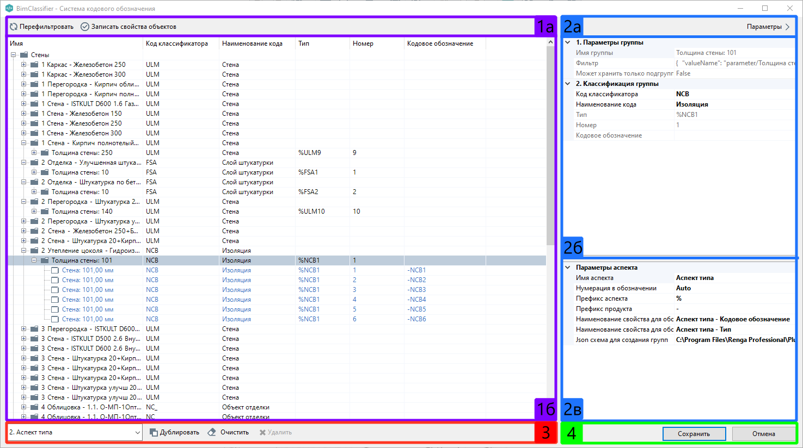

Пользовательский интерфейс
==========================

Интерфейс окна BIM Classifier позволяет формировать свою систему кодового обозначения, создавая столько аспектов, сколько нужно для полного представления системы. 

Панель аспекта
--------------

Панель аспекта состоит из группы :ref:`команд для работы с текущим аспектом <aspect_actions>` ``[1а]`` и окна текущего аспекта ``[1б]``. В окне текущего аспекта отображается сформированное дерево объектов ЦИМ, совмещенное с таблицей данных объектов.

Отображение атрибутов в таблице данных зависит от выбранного аспекта.

Для каждого объекта во всех аспектах отображаются атрибуты:

* ``Код классификатора`` — назначается на панели параметров аспекта;
* ``Наименование кода`` — назначается на панели параметров аспекта;
* ``Номер`` — значение формируется автоматически или не формируется, исходя из параметра аспекта;
* ``Кодовое обозначение`` — значение формируется автоматически.

Данные атрибуты в каждом аспекте могут принимать собственные уникальные значения.

В **Аспекте типа** отображается дополнительный атрибут ``Тип``. Его значение формируется автоматически.

Дерево объектов ЦИМ
-------------------

Дерево объектов ЦИМ формируется по группам и подгруппам по правилам пользователя. Код классификатора и наименование можно назначать как на отдельный объект, так и на всю группу/подгруппу.

.. important::

    При назначении ``Кода классификатора`` на группу все дочерние объекты принимают код своей группы автоматически.

В **Аспекте типа** последняя группа/подгруппа, которая непосредственно содержит объекты является типом.

Панель параметров аспекта
-------------------------

Панель параметров состоит из :ref:`команды Скрыть/Показать панель <parameters_actions>` ``[2а]``, параметров выделенного объекта в дереве объектов ЦИМ ``[2б]`` и параметров текущего аспекта ``[2в]``.

**1. Параметры группы** формируются автоматически из правил построения дерева объектов и даны только для чтения:

* ``Имя группы`` — из JSON-схемы;
* ``Фильтр`` — из JSON-схемы;
* ``Может хранить только подгруппы`` — из JSON-схемы.

**1. Параметры объекта** формируются автоматически и даны только для чтения:

* ``Имя объекта`` — имя объекта в ЦИМ Renga;
* ``Уникальный идентификатор`` — уникальный идентификатор BIM Classifier.

**2. Классификация группы/объекта**:

* ``Код классификатора`` — **заполняется пользователем**;
* ``Наименование кода`` — **заполняется пользователем**;
* ``Тип`` — формируется автоматически, дан только для чтения;
* ``Номер`` — формируется автоматически, дан только для чтения;
* ``Кодовое обозначение`` — формируется автоматически, дан только для чтения.

Параметры из группы ``2. Классификация...`` отображаются в таблице данных аспекта.

Для всех аспектов **Параметры аспекта** состоят из:

* ``Имя аспекта`` — вводится имя аспекта;
* ``Нумерация в обозначении`` — задается будет ли использоваться автонумерация (``Auto``) или нет (``None``);
* ``Префикс продукта`` — указывается префикс для кодового обозначения продукта;
* ``Наименование свойства для обозначения продукта`` — указывается наименование пользовательского свойства, в которое будет записано кодовое обозначение продукта;
* ``Json схема для создания групп`` — указывается файл схемы для аспекта.

**Аспект типа** дополнен еще двумя параметрами:

* ``Префикс типа`` — указывается префикс для кодового обозначения типа;
* ``Наименование свойства для обозначения типа`` — указывается наименование пользовательского свойства, в которое будет записано кодовое обозначение типа.

.. important::

    **Аспект типа** формирует 2 кодовых обозначения (продукта и типа), а **Простой аспект** формирует 1 кодовое обозначение (продукта).

Работа в нескольких аспектах
----------------------------

Переключать аспекты можно через раскрывающийся список ``[3]``, расположенный под панелью текущего аспекта. По умолчанию BIM Classifier предоставляет возможность работы в двух аспектах: **Аспект типа** и **Простой аспект**. С помощью :ref:`команд аспектов <aspects_actions>` ``[3]`` можно создавать новые **пользовательские аспекты**, на основе заданных по умолчанию.